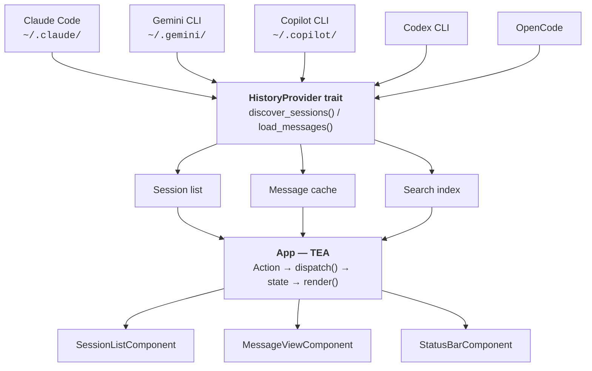
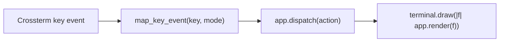
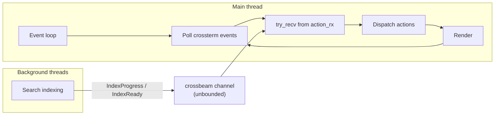

# Architecture

This document describes the high-level architecture of aghist.
If you want to familiarize yourself with the codebase, this is the place to start.

## Bird's-eye view

aghist is a read-only TUI that aggregates conversation history from multiple AI coding assistants into a single interface. It discovers session files on disk, normalises them into a unified model, indexes them for full-text search, and renders them in a terminal UI.



## Entry point

`src/main.rs` handles three execution paths:

1. **TUI mode** (default) — sets up the terminal with crossterm, creates `App`, runs the event loop, then restores terminal state on exit.
2. **`--list`** — prints sessions to stdout and exits.
3. **`export` subcommand** — renders a single session to Markdown, JSON, or HTML and writes to file or stdout.

CLI parsing uses clap with derive macros. Configuration is loaded from `~/.config/aghist/config.toml` (or `%APPDATA%\aghist\config.toml` on Windows) via `Config::load()`. Providers are auto-detected, then filtered against the config's enabled list.

## Provider system

**`src/provider/`**

Every AI tool stores conversation history differently. The provider system abstracts this behind a single trait:

```rust
pub trait HistoryProvider: Send + Sync {
    fn provider(&self) -> Provider;
    fn base_dirs(&self) -> &[PathBuf];
    fn discover_sessions(&self) -> Result<Vec<Session>, ProviderError>;
    fn load_messages(&self, session: &Session) -> Result<Vec<Message>, ProviderError>;
}
```

Each provider implements `detect() -> Option<Self>` to check whether its data directory exists. `detect_all_providers()` in `src/provider/mod.rs` calls each one and collects the ones that are present.

The `Send + Sync` bound allows providers to be shared across threads (wrapped in `Arc<Vec<Box<dyn HistoryProvider>>>`).

Current implementations:

| Provider | Module | Data location | Format |
|----------|--------|---------------|--------|
| Claude Code | `claude_code.rs` | `~/.claude/projects/` | JSONL (one event per line) |
| Copilot CLI | `copilot_cli.rs` | `~/.copilot/session-state/` | JSONL + YAML workspace |
| Gemini CLI | `gemini_cli.rs` | `~/.gemini/tmp/` | JSON |
| Codex CLI | `codex_cli.rs` | User-configurable | JSONL (rollout files) |
| OpenCode | `opencode.rs` | `~/OpenCode/` | Session/message structure |

All providers respect `AGHIST_HOME` as an override for the home directory, primarily used in tests.

### Adding a provider

1. Create `src/provider/your_tool.rs` implementing `HistoryProvider`.
2. Add a `detect()` constructor that returns `None` if the data directory doesn't exist.
3. Register it in `detect_all_providers()` in `src/provider/mod.rs`.
4. Add the provider variant to the `Provider` enum in `src/model/provider.rs`.
5. Add a `"your-tool"` string mapping in `Config::enabled_providers()`.

## Unified model

**`src/model/`**

All provider-specific formats are normalised into three core types:

- **`Session`** — metadata: ID, provider, project path/name, git branch, timestamps, summary, model, token usage, message count, source file path.
- **`Message`** — a single turn: ID, role (`User`/`Assistant`/`System`/`Tool`), timestamp, content blocks, optional model and token usage.
- **`ContentBlock`** — the content within a message: `Text`, `CodeBlock`, `ToolUse`, `ToolResult`, `Thinking`, or `Error`.

IDs are newtypes (`SessionId`, `MessageId`) wrapping `String` to prevent mixing them up.

## TEA architecture

**`src/app.rs`**, **`src/action.rs`**, **`src/event.rs`**

The TUI follows The Elm Architecture (TEA): all state lives in `App`, all mutations go through `dispatch(Action)`, and rendering is a pure function of state.

### Modes

`AppMode` determines which view is active and how key events are interpreted:

| Mode | View | Purpose |
|------|------|---------|
| `Browse` | Session list | Default — navigate and select sessions |
| `ViewSession` | Message view | Read messages in a selected session |
| `Search` | Session list + search input | Full-text search across all messages |
| `Help` | Help overlay | Keybinding reference |
| `Filter` | Filter panel | Filter by provider, project, date range |
| `ExportMenu` | Export overlay | Choose export format (in message view) |

### Action flow



`src/event.rs` maps raw key events to `Action` variants based on the current mode. Each mode has its own mapping function (`map_browse_key`, `map_view_key`, etc.). The `Action` enum in `src/action.rs` covers all possible state transitions: navigation, search input, filter manipulation, data loading, export, and UI toggles.

Background threads also send `Action`s through the same channel (e.g. `SessionsLoaded`, `IndexProgress`, `IndexReady`, `LoadError`), keeping all state changes unified.

## Concurrency

No async runtime. The app uses `crossbeam-channel` for thread communication:



- **Main thread**: runs the event loop — polls terminal events (50ms timeout), drains the action channel, dispatches all actions, renders.
- **Indexing thread**: `start_indexing()` spawns a thread that builds the Tantivy search index. Sends `IndexProgress(current, total)` and `IndexReady` actions back to main.

Messages for a selected session are loaded synchronously on the main thread but cached in an LRU cache (`lru::LruCache`, default size 20) keyed by session ID.

## Search

**`src/search.rs`**

Full-text search uses Tantivy, a Rust search engine library. The index is persisted to disk (platform data directory) and rebuilt incrementally:

- A **manifest** (`manifest.json`) tracks which session files have been indexed and their last-modified timestamps.
- On startup, `build_index()` skips sessions whose source file hasn't changed since the last index build.
- `--reindex` clears the index and manifest, forcing a full rebuild on next launch.

The index schema stores: session ID, message ID, provider, project, role, content text, and timestamp. Queries search the `content` and `project` fields. Results are ranked by Tantivy's BM25 scoring.

## UI components

**`src/ui/`**

Three ratatui components, each responsible for rendering a region of the terminal:

- **`SessionListComponent`** (`session_list.rs`) — renders the session list with provider icons, project names, dates, and summaries. Handles selection state.
- **`MessageViewComponent`** (`message_view.rs`) — renders messages with role-coloured headers, text wrapping, code blocks, collapsible tool calls, and thinking blocks. Manages vertical scroll.
- **`StatusBarComponent`** (`status_bar.rs`) — shows the current mode, session/message counts, active filters, search query, and contextual keybinding hints.

The colour palette in `src/ui/mod.rs` uses Catppuccin-inspired RGB values with provider-specific accent colours.

## Export

**`src/export.rs`**

Three output formats, all producing a complete standalone document:

- **Markdown** — headers, metadata block, role sections, code fences, `<details>` for tool calls.
- **JSON** — `serde_json::to_string_pretty` of session + messages.
- **HTML** — self-contained page with embedded CSS, dark mode support via `prefers-color-scheme`, and role-coloured message cards.

## Error handling

- `thiserror` for library error types (`ProviderError`, `SearchError`).
- `anyhow` only at the binary boundary (`main.rs`).
- `color_eyre` installed for panic reports.
- Corrupt or missing session files are skipped with warnings, never crash the app.
- `unsafe` code is forbidden via `#![forbid(unsafe_code)]` lint.
