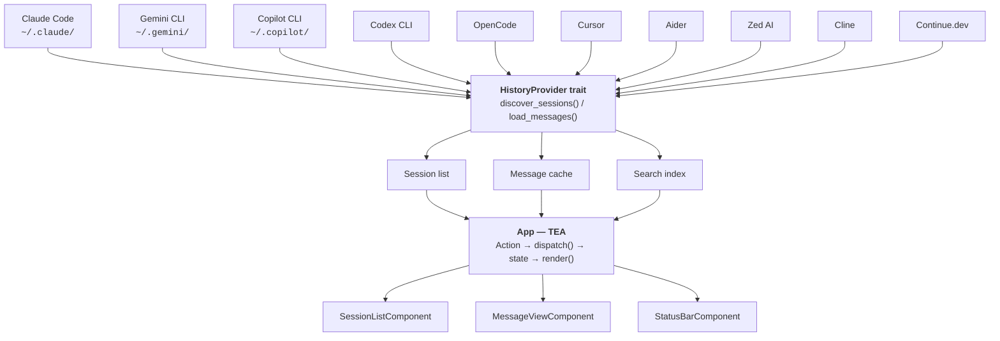
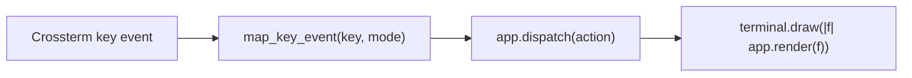
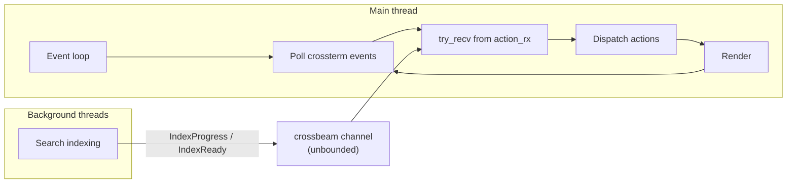

# Architecture

This document describes the high-level architecture of aghist.
If you want to familiarize yourself with the codebase, this is the place to start.

## Bird's-eye view

aghist is a read-only TUI that aggregates conversation history from multiple AI coding assistants into a single interface. It discovers session files on disk, normalises them into a unified model, indexes them for full-text search, and renders them in a terminal UI.


```mermaid
graph TD
    CC["Claude Code<br><code>~/.claude/</code>"] --> HP
    GC["Gemini CLI<br><code>~/.gemini/</code>"] --> HP
    CP["Copilot CLI<br><code>~/.copilot/</code>"] --> HP
    CX["Codex CLI"] --> HP
    OC["OpenCode"] --> HP
    CU["Cursor"] --> HP
    AD["Aider"] --> HP
    ZA["Zed AI"] --> HP
    CL["Cline"] --> HP
    CD["Continue.dev"] --> HP

    HP["<b>HistoryProvider trait</b><br>discover_sessions() / load_messages()"]

    HP --> SL[Session list]
    HP --> MC[Message cache]
    HP --> SI[Search index]

    SL --> APP
    MC --> APP
    SI --> APP

    APP["<b>App — TEA</b><br>Action → dispatch() → state → render()"]

    APP --> UI_SL[SessionListComponent]
    APP --> UI_MV[MessageViewComponent]
    APP --> UI_SB[StatusBarComponent]
```

## Entry point

`src/main.rs` is intentionally thin: it initializes tracing/panic reporting,
normalizes clap errors into the JSON error envelope, and hands the parsed CLI
to `src/commands/dispatch.rs`. Command implementations live under
`src/commands/`.

The dispatcher handles two broad execution paths:

1. **TUI mode** (no subcommand, no `--list`) — sets up the terminal with crossterm, creates `App`, runs the event loop, then restores terminal state on exit.
2. **One-shot CLI subcommands** — see the full surface in [`CLAUDE.md`](../CLAUDE.md#agent-friendly-cli-surface). Each subcommand emits stable JSON on a pipe, uses semantic exit codes, and has a discoverable JSON-Schema (`aghist schema <subcmd>`).

CLI parsing uses clap with derive macros. Configuration is loaded from `~/.config/aghist/config.toml` (or `%APPDATA%\aghist\config.toml` on Windows) via `Config::load()`. Providers are auto-detected, then filtered against the config's enabled list.

### Output discipline

Successful command output goes to stdout as either a JSON document (machine modes) or a human-readable table (TTY mode); errors go to stderr as a single-line `{"error":{"kind":"…","message":"…","hint":"…"}}` envelope and never to stdout. `--json` and `--ndjson` are global flags that override the TTY auto-detect; they are mutually exclusive. Exit codes are stable contract: `0` success, `1` runtime error, `2` usage error, `3` success-but-empty (treat as the empty answer, not a failure).

### Citation refs

`<provider-slug>/<session-id>#<turn>` (e.g. `claude-code/abc-123#7`) is the canonical handle for a single message. Remote/federated refs add an optional source prefix: `<source>:<provider-slug>/<session-id>#<turn>`. Refs are *opaque-stable across reindex* — the same `(source, provider, session-id, turn)` points at the same message as long as the source files are unchanged. `src/model/citation.rs` defines `CitationRef`/`QualifiedCitationRef`; `src/session_resolver.rs` centralizes local, remote, and ambiguous lookup behavior for CLI and MCP callers.

## Provider system

**`src/provider/`**

Every AI tool stores conversation history differently. The provider system abstracts this behind a single trait:

```rust
pub trait HistoryProvider: Send + Sync {
    fn provider(&self) -> Provider;
    fn base_dirs(&self) -> &[PathBuf];
    fn discover_sessions(&self) -> Result<Vec<Session>, ProviderError>;
    fn load_messages(&self, session: &Session) -> Result<Vec<Message>, ProviderError>;
}
```

Each provider implements `detect() -> Option<Self>` to check whether its data directory exists. `src/provider/registry.rs` is the single runtime registry for local detection, stateless fallback loading, explicit provider construction from directories, and remote-cache candidate dirs.

The `Send + Sync` bound allows providers to be shared across threads as `Box<dyn HistoryProvider>`.

The user-facing provider list belongs in the README. The source of truth for
runtime behavior is the `Provider` enum plus `src/provider/registry.rs`; avoid
duplicating provider paths/formats here because those details drift as upstream
tools change their storage.

All providers respect `AGHIST_HOME` as an override for the home directory, primarily used in tests.

### Adding a provider

1. Create `src/provider/your_tool.rs` implementing `HistoryProvider`.
2. Add a `detect()` constructor that returns `None` if the data directory doesn't exist.
3. Add the provider variant and `ProviderSpec` entry in `src/model/provider.rs`.
4. Register detection/stateless/remote-dir construction in `src/provider/registry.rs`.
5. Add focused parser tests plus generated fixture support under `tests/common/fixtures/`.
6. Run `cargo test --test provider_conformance`; update the generated provider contract snapshot only when the normalized model change is intentional.

## Unified model

**`src/model/`**

All provider-specific formats are normalised into three core types:

- **`Session`** — metadata: ID, provider, project path/name, git branch, timestamps, summary, model, token usage, message count, source file path.
- **`Message`** — a single turn: ID, role (`User`/`Assistant`/`System`/`Tool`), timestamp, content blocks, optional model and token usage.
- **`ContentBlock`** — the content within a message: `Text`, `CodeBlock`, `ToolUse`, `ToolResult`, `Thinking`, or `Error`.

IDs are newtypes (`SessionId`, `MessageId`) wrapping `String` to prevent mixing them up.

## TEA architecture

**`src/app.rs`**, **`src/action.rs`**, **`src/event.rs`**

The TUI follows The Elm Architecture (TEA): all state lives in `App`, all mutations go through `dispatch(Action)`, and rendering is a pure function of state.

### Modes

`AppMode` determines which view is active and how key events are interpreted:

| Mode | View | Purpose |
|------|------|---------|
| `Browse` | Session list | Default — navigate and select sessions |
| `ViewSession` | Message view | Read messages in a selected session |
| `Search` | Session list + search input | Full-text search across all messages |
| `Help` | Help overlay | Keybinding reference |
| `Filter` | Filter panel | Filter by provider, project, date range |
| `ExportMenu` | Export overlay | Choose export format (in message view) |

### Action flow


```mermaid
flowchart LR
    A[Crossterm key event] --> B["map_key_event(key, mode)"]
    B --> C["app.dispatch(action)"]
    C --> D["terminal.draw(|f| app.render(f))"]
```

`src/event.rs` maps raw key events to `Action` variants based on the current mode. Each mode has its own mapping function (`map_browse_key`, `map_view_key`, etc.). The `Action` enum in `src/action.rs` covers all possible state transitions: navigation, search input, filter manipulation, data loading, export, and UI toggles.

Background threads also send `Action`s through the same channel (e.g. `SessionsLoaded`, `IndexProgress`, `IndexReady`, `LoadError`), keeping all state changes unified.

## Concurrency

No async runtime. The app uses `crossbeam-channel` for thread communication:


```mermaid
flowchart LR
    subgraph Main thread
        EL[Event loop] --> Poll[Poll crossterm events]
        Poll --> Recv["try_recv from action_rx"]
        Recv --> Disp[Dispatch actions]
        Disp --> Render[Render]
        Render --> Poll
    end

    subgraph Background threads
        IDX[Search indexing]
    end

    IDX -- "IndexProgress / IndexReady" --> CH
    CH["crossbeam channel<br>(unbounded)"] --> Recv
```

- **Main thread**: runs the event loop — polls terminal events (50ms timeout), drains the action channel, dispatches all actions, renders.
- **Indexing thread**: `start_indexing()` spawns a thread that builds the Tantivy search index. Sends `IndexProgress(current, total)` and `IndexReady` actions back to main.

Messages for a selected session are loaded synchronously on the main thread but cached in an LRU cache (`lru::LruCache`, default size 20) keyed by session ID.

## Search

**`src/search.rs`**, **`src/embed.rs`**

Full-text search uses Tantivy. The index is persisted to disk (platform cache directory, overridable via `AGHIST_INDEX_DIR`) and rebuilt incrementally:

- A **manifest** (`manifest.json`) tracks which session files have been indexed and their content hashes.
- `build_index()` skips sessions whose hash matches the manifest.
- `aghist index --force` clears the index and manifest, forcing a full rebuild.
- The index schema stores: session ID, message ID, provider, project, role, content text, tool-call output text (separate field, indexed for `--has-tool-call`), source-cache name (for federation), and timestamp.
- `tests/recall_bench.rs` builds a mixed-provider synthetic corpus and enforces conservative recall/MRR and latency gates. Regenerate [`docs/SEARCH_BENCH.md`](SEARCH_BENCH.md) with `AGHIST_BENCH_WRITE_REPORT=1 cargo test --test recall_bench -- --nocapture` after intentional benchmark changes.

### Filters and pagination

Global filter flags (`--provider`, `--since`, `--until`, `--project`, `--role`, `--has-tool-call`) are applied as Tantivy query terms or post-filter passes depending on the field. `--list` and `search` paginate via opaque base64 cursors (`{last_score, last_session_id}` or `{started_at, session_id}`), never offset-based — agents always know whether more results remain via `meta.next_cursor`.

### Hybrid (lexical + semantic)

Optional. Behind `--accept-download` consent (persisted next to the index), `aghist index` also computes FastEmbed (`AllMiniLML6V2`, ~90 MB) embeddings into a sidecar table keyed by message content hash. `aghist search --hybrid-weight <w>` (`0` = lexical-only, `1` = semantic-only, `0.5` = even RRF blend) fuses BM25 and cosine ranks via Reciprocal Rank Fusion.

The system **fails open**: without consent or without the `embeddings` build feature, hybrid search degrades silently to lexical (the response's `meta.engine` field reports which path served the query). Embedding cache invalidation is keyed by message content hash, so reindex is cheap when message text is unchanged.

### Federated (cross-machine)

`aghist sources add` registers a remote (`<host>:<path>`) and `sources pull` rsyncs `<host>:<path>/` to `~/.cache/aghist/sources/<name>/data/` (cache root overridable via `AGHIST_SOURCES_CACHE_DIR`). Remote caches can be full home mirrors or exact provider history dirs; `provider::registry::remote_candidate_dirs` supplies both interpretations for each provider. Search/list/show/export/diff results carry a `source` field (`local` or `<remote-name>`); source-qualified refs (`work:claude-code/abc#7`) disambiguate duplicates.

## MCP server

**`src/mcp.rs`**

`aghist mcp` runs a JSON-RPC 2.0 server over stdio per the [MCP stdio transport](https://modelcontextprotocol.io/). It exposes aghist's read paths to agent clients without requiring them to parse the CLI:

Tool definitions live in `src/mcp/payload.rs` and handlers under
`src/mcp/tool_handlers/`; keep those as the source of truth. At a high level,
the server exposes search/list/get-message/get-session, reindex, and health
paths with the same read-only constraints as the CLI.

Resources are exposed as `aghist://session/<provider>/<session-id>` and `aghist://session/<provider>/<session-id>/turn/<n>` for local sessions, plus `aghist://source/<source>/session/<provider>/<session-id>` forms for remote-source sessions — agents can attach an entire session or a single turn as context.

The server is implicitly read-only (no tools mutate session content; `reindex` only refreshes the search index). The `provider.mcp_exposed` config narrows which providers are visible to MCP clients independently of the CLI's `enabled` list — useful for hiding personal accounts from work agents on the same machine.

## UI components

**`src/ui/`**

Three ratatui components, each responsible for rendering a region of the terminal:

- **`SessionListComponent`** (`session_list.rs`) — renders the session list with provider icons, project names, dates, and summaries. Handles selection state.
- **`MessageViewComponent`** (`message_view.rs`) — renders messages with role-coloured headers, text wrapping, code blocks, collapsible tool calls, and thinking blocks. Manages vertical scroll.
- **`StatusBarComponent`** (`status_bar.rs`) — shows the current mode, session/message counts, active filters, search query, and contextual keybinding hints.

The colour palette in `src/ui/mod.rs` uses Catppuccin-inspired RGB values with provider-specific accent colours.

## Export

**`src/export.rs`**

Three output formats, all producing a complete standalone document:

- **Markdown** — headers, metadata block, role sections, code fences, `<details>` for tool calls.
- **JSON** — `serde_json::to_string_pretty` of session + messages.
- **HTML** — self-contained page with embedded CSS, dark mode support via `prefers-color-scheme`, and role-coloured message cards.

## Error handling

- `thiserror` for library error types (`ProviderError`, `SearchError`).
- `anyhow` only at the binary boundary (`main.rs`).
- `color_eyre` installed for panic reports.
- Corrupt or missing session files are skipped with warnings, never crash the app.
- `unsafe` code is forbidden via `#![forbid(unsafe_code)]` lint.

## Release and install safety

Release packaging is shared through `scripts/package-release.sh`. CI runs a
release dry-run on every main/PR CI pass: build a self-updating release binary,
package a synthetic archive, install it locally with `install.sh --archive`,
verify the binary and `aghist.install` marker, then uninstall it. The tag
release workflow uses the same packaging script before publishing artifacts.
